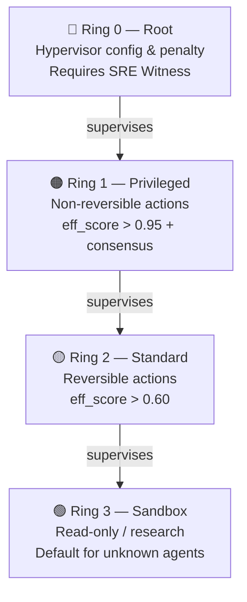
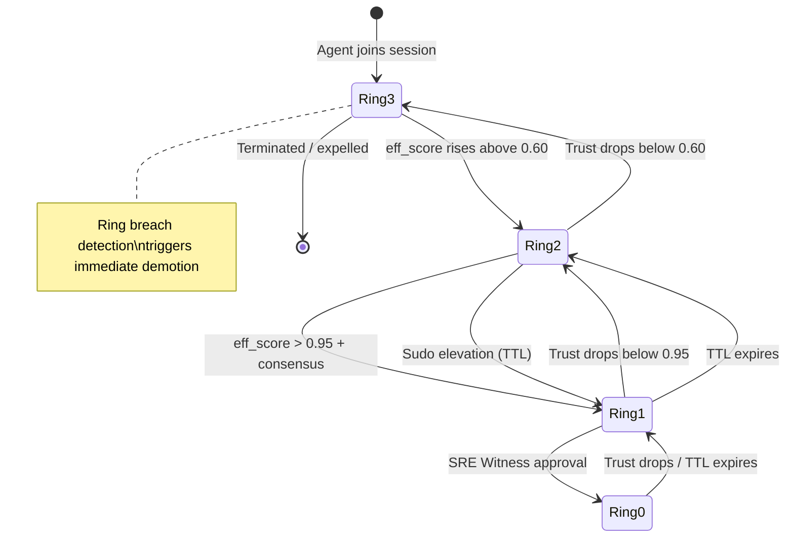
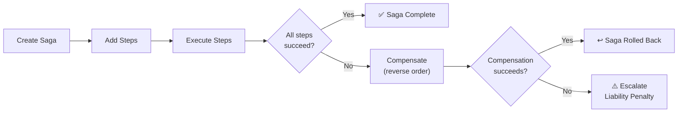
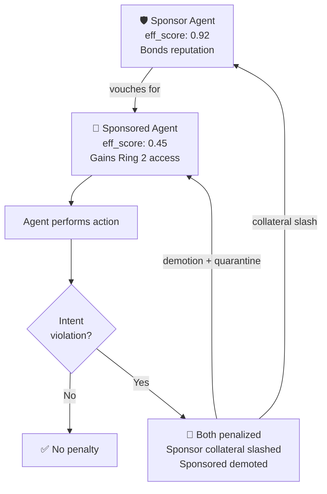
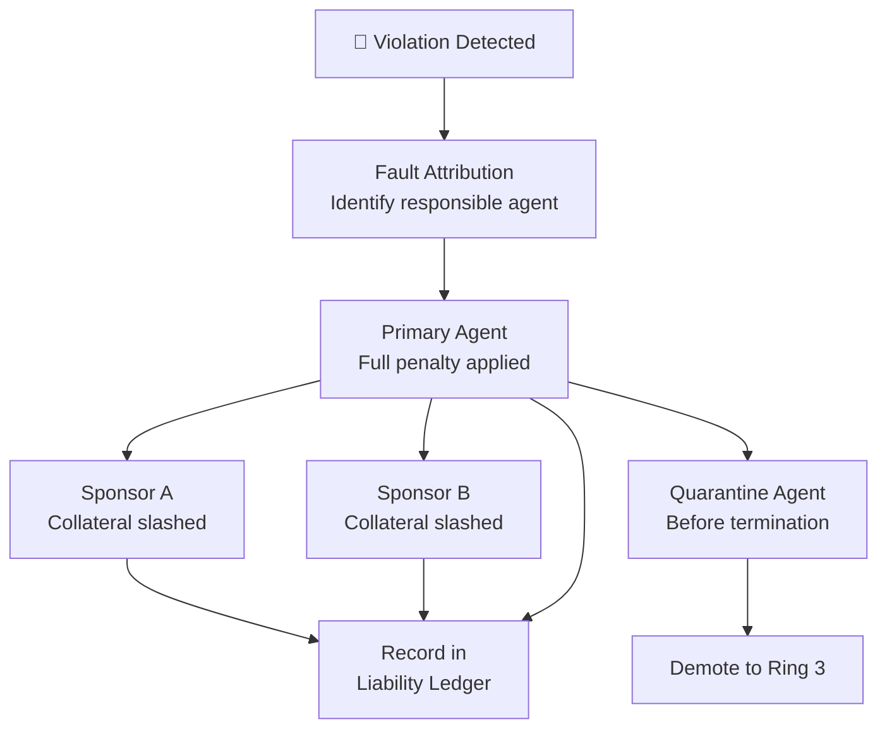
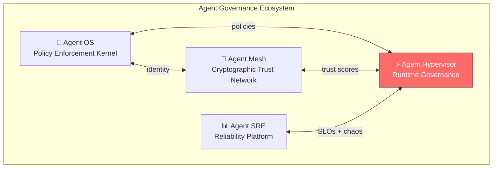

<div align="center">

# Agent Hypervisor — Community Edition

**VMware for AI Agents — runtime isolation, execution rings, and governance for autonomous agents**

*Just as VMware isolates virtual machines, Agent Hypervisor isolates AI agent sessions<br/>and enforces governance boundaries with a kill switch, blast radius containment, and accountability.*

[](https://github.com/imran-siddique/agent-hypervisor/stargazers)
[](https://github.com/sponsors/imran-siddique)
[](LICENSE)
[](https://python.org)
[](https://github.com/imran-siddique/agent-hypervisor/actions/workflows/ci.yml)
[](https://pypi.org/project/agent-hypervisor/)
[](https://pypi.org/project/agent-hypervisor/)
[](https://genai.owasp.org)
[](https://github.com/imran-siddique/agent-hypervisor)
[](benchmarks/)
[](https://github.com/imran-siddique/agent-hypervisor/discussions)

> ⭐ **If this project helps you, please star it!** It helps others discover Agent Hypervisor.

> 📦 **Install the full stack:** `pip install ai-agent-governance[full]` — [PyPI](https://pypi.org/project/ai-agent-governance/) | [GitHub](https://github.com/imran-siddique/agent-governance)

[Quick Start](#quick-start) • [Why a Hypervisor?](#-why-agent-hypervisor) • [Features](#key-features) • [Architecture](#architecture-diagrams) • [Performance](#performance) • [Ecosystem](#ecosystem)

</div>

---

### Integrated Into Major AI Frameworks

<p align="center">
  <a href="https://github.com/langgenius/dify-plugins/pull/2060"></a>
  <a href="https://github.com/run-llama/llama_index/pull/20644"></a>
  <a href="https://github.com/github/awesome-copilot/pull/755"></a>
  <a href="https://github.com/microsoft/agent-lightning/pull/478"></a>
  <a href="https://github.com/magsther/awesome-opentelemetry/pull/24"></a>
</p>

## 📊 By The Numbers

<table>
<tr>
<td align="center"><h3>457+</h3><sub>Tests Passing</sub></td>
<td align="center"><h3>4</h3><sub>Execution Rings<br/>(Ring 0–3)</sub></td>
<td align="center"><h3>268μs</h3><sub>Full Governance<br/>Pipeline Latency</sub></td>
<td align="center"><h3>v2.0</h3><sub>Saga Compensation<br/>Kill Switch · Rate Limits</sub></td>
</tr>
</table>

## 💡 Why Agent Hypervisor?

> **The problem:** AI agents run with unlimited resources, no isolation, and no kill switch. A single rogue agent in a shared session can escalate privileges, corrupt state, or cascade failures across your entire system.

> **Our solution:** A hypervisor that enforces execution rings, resource limits, saga compensation, and runtime governance — giving you a kill switch, blast radius containment, and joint liability for agent accountability.

### How It Maps to What You Already Know

| OS / VM Hypervisor | Agent Hypervisor | Why It Matters |
|-------------------|-----------------|----------------|
| CPU rings (Ring 0–3) | **Execution Rings** — privilege levels based on trust score | Graduated access, not binary allow/deny |
| Process isolation | **Session isolation** — VFS namespacing, DID-bound identity | Rogue agents can't corrupt other sessions |
| Memory protection | **Liability protection** — bonded reputation, collateral slash | Sponsors have skin in the game |
| System calls | **Saga transactions** — multi-step ops with automatic rollback | Failed workflows undo themselves |
| Watchdog timer | **Kill switch** — graceful termination with step handoff | Stop runaway agents without data loss |
| Audit logs | **Hash-chained delta trail** — tamper-evident forensic trail | Prove exactly what happened |

## Quick Start

```bash
pip install agent-hypervisor
```

```python
from hypervisor import Hypervisor, SessionConfig, ConsistencyMode

hv = Hypervisor()

# Create an isolated session with governance
session = await hv.create_session(
    config=SessionConfig(enable_audit=True),
    creator_did="did:mesh:admin",
)

# Agent joins — ring assigned automatically by trust score
ring = await hv.join_session(
    session.sso.session_id,
    "did:mesh:agent-1",
    sigma_raw=0.85,
)
# → RING_2_STANDARD (trusted agent)

# Activate and run a governed saga
await hv.activate_session(session.sso.session_id)
saga = session.saga.create_saga(session.sso.session_id)
step = session.saga.add_step(
    saga.saga_id, "draft_email", "did:mesh:agent-1",
    execute_api="/api/draft", undo_api="/api/undo-draft",
    timeout_seconds=30, max_retries=2,
)
result = await session.saga.execute_step(
    saga.saga_id, step.step_id, executor=draft_email,
)

# Terminate — returns tamper-evident audit hash
hash_root = await hv.terminate_session(session.sso.session_id)
```

## Architecture Diagrams

### Execution Ring Hierarchy



### Ring Promotion / Demotion Flow



### Saga Lifecycle



### Joint Liability Vouch Chain



### Slash Cascade Propagation



## Key Features

<table>
<tr>
<td width="50%">

### 🔐 Execution Rings
Hardware-inspired privilege model (Ring 0–3). Agents earn ring access based on trust score. Real-time demotion on trust drops. Sudo elevation with TTL. Breach detection with circuit breakers.

</td>
<td width="50%">

### 🛑 Kill Switch
Graceful termination with saga step handoff to substitute agents. Rate limiting per agent per ring (sandbox: 5 rps, root: 100 rps). Stop runaway agents without data loss.

</td>
</tr>
<tr>
<td width="50%">

### 🔄 Saga Compensation
Multi-step transactions with timeout enforcement, retry with backoff, reverse-order compensation, and escalation to liability. Parallel execution with ALL/MAJORITY/ANY policies.

</td>
<td width="50%">

### 🤝 Joint Liability
High-trust agents sponsor low-trust agents by bonding reputation. If the sponsored agent violates intent, **both are penalized**. Fault attribution, quarantine-before-terminate, persistent ledger.

</td>
</tr>
<tr>
<td width="50%">

### 📋 Hash-Chained Audit
Forensic-grade delta trails — semantic diffs, hash-chained entries, summary commitment at session end. Garbage collection preserves forensic artifacts.

</td>
<td width="50%">

### 📡 Observability
Structured event bus emits typed events for every action. Causal trace IDs with full delegation tree encoding. Version counters for causal consistency.

</td>
</tr>
</table>

<details>
<summary><b>📖 Feature details (click to expand)</b></summary>

### 🔐 Execution Rings — Deep Dive

```
Ring 0 (Root)       — Hypervisor config & penalty — requires SRE Witness
Ring 1 (Privileged) — Non-reversible actions — requires eff_score > 0.95 + consensus
Ring 2 (Standard)   — Reversible actions — requires eff_score > 0.60
Ring 3 (Sandbox)    — Read-only / research — default for unknown agents
```

**v2.0 additions:** Dynamic ring elevation (sudo with TTL), ring breach detection with circuit breakers, ring inheritance for spawned agents.

### 🔄 Saga Orchestrator — Deep Dive

- **Timeout enforcement** — steps that hang are automatically cancelled
- **Retry with backoff** — transient failures retry with exponential delay
- **Reverse-order compensation** — on failure, all committed steps are undone
- **Escalation** — if compensation fails, Joint Liability penalty is triggered
- **Parallel execution** — ALL_MUST_SUCCEED / MAJORITY / ANY policies
- **Execution checkpoints** — partial replay without re-running completed effects
- **Declarative DSL** — define sagas via YAML or dict

### 🔒 Session Consistency

- **Version counters** — causal consistency for shared VFS state
- **Resource locks** — READ/WRITE/EXCLUSIVE with lock timeout
- **Isolation levels** — SNAPSHOT, READ_COMMITTED, SERIALIZABLE per saga

</details>

## Performance

| Operation | Mean Latency | Throughput |
|-----------|-------------|------------|
| Ring computation | **0.3μs** | 3.75M ops/s |
| Delta audit capture | **27μs** | 26K ops/s |
| Session lifecycle | **54μs** | 15.7K ops/s |
| 3-step saga | **151μs** | 5.3K ops/s |
| **Full governance pipeline** | **268μs** | **2,983 ops/s** |

> Full pipeline = session create + agent join + 3 audit deltas + saga step + terminate with audit log root

## Installation

```bash
pip install agent-hypervisor
```

## Modules

| Module | Description | Tests |
|--------|-------------|-------|
| `hypervisor.session` | Shared Session Object lifecycle + VFS | 52 |
| `hypervisor.rings` | 4-ring privilege + elevation + breach detection | 34 |
| `hypervisor.liability` | Sponsorship, penalty, attribution, quarantine, ledger | 39 |
| `hypervisor.reversibility` | Execute/Undo API registry | 4 |
| `hypervisor.saga` | Saga orchestrator + fan-out + checkpoints + DSL | 41 |
| `hypervisor.audit` | Delta engine, audit log, GC, commitment | 10 |
| `hypervisor.verification` | DID transaction history verification | 4 |
| `hypervisor.observability` | Event bus, causal trace IDs | 22 |
| `hypervisor.security` | Rate limiter, kill switch | 16 |
| `hypervisor.integrations` | Nexus, Verification, IATP cross-module adapters | -- |
| **Integration** | End-to-end lifecycle, edge cases, security | **24** |
| **Scenarios** | Cross-module governance pipelines (7 suites) | **18** |
| **Total** | | **457** |

## Test Suite

```bash
# Run all tests
pytest tests/ -v

# Run only integration tests
pytest tests/integration/ -v

# Run benchmarks
python benchmarks/bench_hypervisor.py
```

## Cross-Module Integrations

The Hypervisor supports optional integration with external trust scoring, behavioral verification, and capability manifest systems via adapters in `hypervisor.integrations`. See the adapter modules for usage examples.

### REST API

Full FastAPI REST API with 22 endpoints and interactive Swagger docs:

```bash
pip install agent-hypervisor[api]
uvicorn hypervisor.api.server:app
# Open http://localhost:8000/docs for Swagger UI
```

Endpoints: Sessions, Rings, Sagas, Liability, Events, Health.

### Visualization Dashboard

Interactive Streamlit dashboard with 5 tabs:

```bash
cd examples/dashboard
pip install -r requirements.txt
streamlit run app.py
```

Tabs: Session Overview | Execution Rings | Saga Orchestration | Liability & Trust | Event Stream

## Ecosystem

Agent Hypervisor is part of the **Agent Governance Ecosystem** — four specialized repos that work together:



| Repo | Role | Stars |
|------|------|-------|
| [Agent OS](https://github.com/imran-siddique/agent-os) | Policy enforcement kernel | 1,500+ tests |
| [Agent Mesh](https://github.com/imran-siddique/agent-mesh) | Cryptographic trust network | 1,400+ tests |
| [Agent SRE](https://github.com/imran-siddique/agent-sre) | SLO, chaos, cost guardrails | 1,070+ tests |
| **Agent Hypervisor** | Session isolation & governance runtime | 457+ tests |

## Frequently Asked Questions

**Why use a hypervisor for AI agents?**
Just as OS hypervisors isolate virtual machines and enforce resource boundaries, an agent hypervisor isolates AI agent sessions and enforces governance boundaries. Without isolation, a misbehaving agent in a shared session can corrupt state, escalate privileges, or cascade failures across the entire system.

**How do Execution Rings differ from traditional access control?**
Traditional access control is static and binary (allowed/denied). Execution Rings are dynamic and graduated -- agents earn ring privileges based on their trust score, can request temporary elevation with TTL (like `sudo`), and are automatically demoted when trust drops. Ring breach detection catches anomalous behavior before damage occurs.

**What happens when a multi-agent saga fails?**
The Saga Orchestrator triggers reverse-order compensation for all committed steps. For parallel execution sagas, the failure policy determines the response: ALL_MUST_SUCCEED compensates if any branch fails, MAJORITY allows minority failures, and ANY succeeds if at least one branch completes. Execution checkpoints enable partial replay without re-running completed effects.

**How does fault attribution work?**
When a saga fails, the hypervisor identifies the agent responsible for the failure and triggers appropriate liability consequences.

## Contributing

We welcome contributions! Please see our [Contributing Guide](CONTRIBUTING.md) for details.

- :bug: [Report a Bug](https://github.com/imran-siddique/agent-hypervisor/issues/new?labels=bug)
- :bulb: [Request a Feature](https://github.com/imran-siddique/agent-hypervisor/issues/new?labels=enhancement)
- :speech_balloon: [Join Discussions](https://github.com/imran-siddique/agent-hypervisor/discussions)
- Look for issues labeled [`good first issue`](https://github.com/imran-siddique/agent-hypervisor/labels/good%20first%20issue) to get started

## License

MIT -- see [LICENSE](LICENSE).

---

<div align="center">

**[Agent OS](https://github.com/imran-siddique/agent-os)** | **[AgentMesh](https://github.com/imran-siddique/agent-mesh)** | **[Agent SRE](https://github.com/imran-siddique/agent-sre)** | **[Agent Hypervisor](https://github.com/imran-siddique/agent-hypervisor)**

*Built with :heart: for the AI agent governance community*

If Agent Hypervisor helps your work, please consider giving it a :star:

</div>
